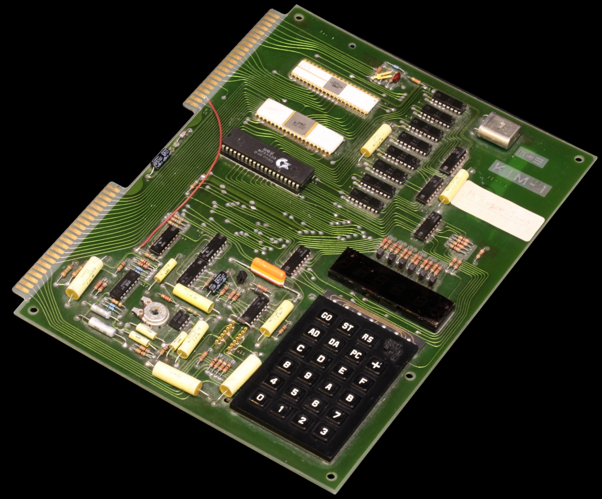

## Micro-Controller-Introduction

---

### by Jogi 

---

* Short History / Introduction
* Different Micro-Controllers
* Programming-Environments
* Microcontroller-Learning-Environments
* Back to History
* Demo ("Hello World")

---

### This was my first computer

---

### This _IS_ still my first computer

---

### A klone of KIM 1 (by Commodore)

---

### Famous Apple ][ 

---

### Famous Commodore C64 

---

### Architecture of Junior

---

- egon
- hugo
- some more stuff

---

## And one final slide

| one   | two   |
|-------|-------|
| 1     | 2     |
| eins  | zwei  |

- egon
- hugo

---

### Linkcollection for now

* KIM-Uno: https://www.hackster.io/obsolescence/kim-uno-a-6502-kim-1-computer-on-arduino-e5c82c
* 6502 : http://www.6502.org/source/
* UF2 : https://makecode.com/blog/one-chip-to-flash-them-all 
* UF2 : https://github.com/microsoft/uf2
* Pico - Arduino : https://www.heise.de/tests/Raspberry-Pico-mit-der-Arduino-IDE-programmieren-6001575.html

---

### Legal stuff

* Von Rama &amp; Musée Bolo - Eigenes Werk, CC BY-SA 2.0 fr, https://commons.wikimedia.org/w/index.php?curid=11292404
* Von Narnars0 - Eigenes Werk, CC BY-SA 3.0, https://commons.wikimedia.org/w/index.php?curid=32247697
* Von Evan-Amos - Eigenes Werk, Gemeinfrei, https://commons.wikimedia.org/w/index.php?curid=17414886

---

## Raspberry Pi Pico

* always starts as UF2-Board
* Microsoft-defined USB-Format
* especially dedicated for downloading firmware to µC via USB

---

### Python 

* Micro-Python
* Circuit Python

---

### Micro-Python

* Attempt to put Python on Micro-Controller-Boards
* Started with an own Board
* Interpreter now available for a lot of µC-Boards
* Including the Raspberry-Pi Pico

---

### Servo at Raspberry Pi Pico

* https://www.youngwonks.com/blog/How-to-use-a-servo-motor-with-the-Raspberry-Pi-Pico
* Attention : Micro-Python

---

### Nice getting started

* https://ordina-jworks.github.io/iot/2021/03/25/Getting-started-with-the-pi-pico.html
* Shows also SDK, Micro-Python and Circuit-Python
* 

##  

