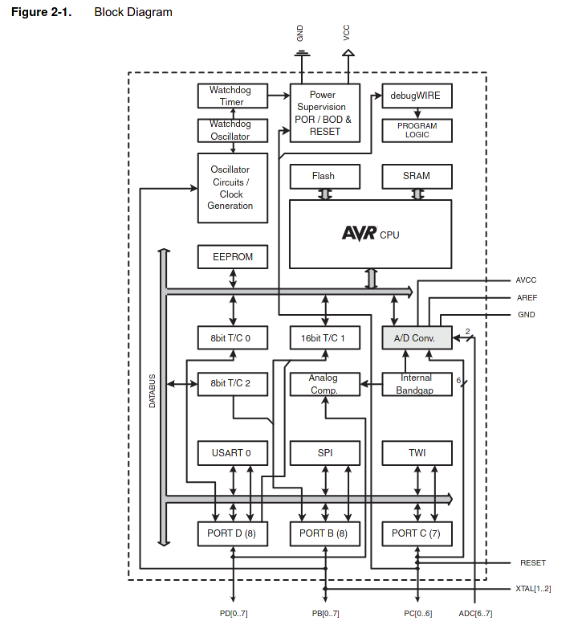
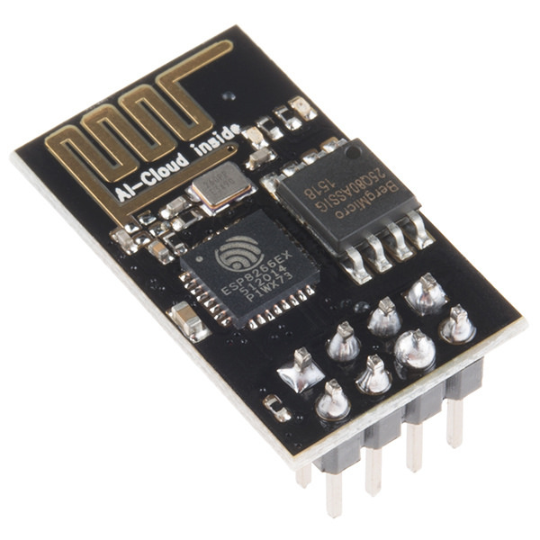

## Micro-Controller-Introduction

---

### by Jogi 

---

* Short History / Introduction
* Different Micro-Controllers
* Programming-Environments
* Microcontroller-Learning-Environments
* Back to History
* Demo ("Hello World")

---

### My first computer (6502 CPU)

---

### This _IS_ my first computer

---

### KIM 1-Clone (6502 CPU) 

---

### Apple ][ (6502 CPU)

---

### Commodore C64 (6502 CPU)

---

### Why show my first computer?

2 Main reasons 

* Good explanation of Architecture
* Come back later in presentation ... 

---

### Architecture of Junior

---

### The 6502 CPU

---

### Architecture of Junior

---

### The 6532 (RAM I/O Timer)

---

### Programming

---

## some years later ...

---

### Siemens 80c166

---

### 80c166 Architecture

{height=80%}

---

### Programming Environment

---

### In its environment

---

### Final Product

---

### Interim Summary

* Concept of MC (Micro-Controller) is old
* Programming needs Cross-Toolchain
* usually complicated setup
* difficult to start with
* not fitting the needs of "hobbyist"

---

### 2006 Arduino enters the world

* Arduino is a ECO-system
* Hardware ("standardised") with AVR-MC
* Hardware : rather cheap, open designs
* so called Shields : to be stacked on top
* Software is for free 
* Rather easy, but complete "IDE"
* includes/hides all details incl download
* Processing => Windows/Mac/Linux

---

### Arduino UNO

---

### Arduino Leonardo

---

### Shields (I)

---

### Shields (II)

---

### Shields (III)

---

### Shields (IV)

---

### Block-Diagramm AVR 

---

### "THE" innovation 

---

### "All in one"
 

---

### The IDE

---

### 2012 Raspberry PI Enters the world

---

### __STOP__ : Raspberry Pi is __NOT__ a Micro-Controller

---

## Raspberry PI

* Is NOT a Micro Controller
* Is based on an ARM-Cortex Application-Processor
* Its CPU is intended to run General Purpose OS for Multi-User/Multi-Task, eg Linux
* the fancy stuff ( Memory Management Unit, Caches, ... ) 
* difficult to setup for "simple" Controller-Tasks
* common with Micro-Controllers: especially PINS to be used as GPIO, I2C, SPI-Bus, ...
* "Nice" project about Bare-Metal on Raspberry PI (see links)

---

### 2014 : ESP 8266 enters the world

(Target of future lightning talk)

### 2016 : ESP 32 enters the world

(Target of future lightning talk)

---

### In the meantime : ARM

* Acorn RISC Machine
* From the beginning: 32 Bit (16 Bit Thumb-Mode)
* now: 3 categories
   * ARM Cortex A (Application Processor)
   * ARM Cortex M (Micro-Controller)
   * ARM Cortex R (Realtime-CPU)

---

### Arduinos and other => ARM

* Still AVR available
* More power => ARM
* Arduino-IDE able to cover them all
* through board-library

---

### ARM 

* Sells IP only, no HW
* Therefore ARMs from a lot of different silicon vendors
* Actual : ARM is beeing aquired
* You know by whom ?

---

### Yes: Linus best friend...

---

### 2021 Raspberry Pi Pico enters the world

---

## Raspberry Pi Pico

* always starts as UF2-Board
* Microsoft-defined USB-Format
* especially dedicated for downloading firmware to µC via USB

---

### C/C++ via SDK

* THE Guide from Raspberry : https://datasheets.raspberrypi.org/pico/getting-started-with-pico.pdf
* THE SDK on Github : https://github.com/raspberrypi/pico-sdk

---

### Arduino Environment

* https://www.heise.de/tests/Raspberry-Pico-mit-der-Arduino-IDE-programmieren-6001575.html

---

### Python 

* Micro-Python
* Circuit Python

---

### Micro-Python

* Attempt to put Python on Micro-Controller-Boards
* Started with an own Board
* Interpreter now available for a lot of µC-Boards
* Including the Raspberry-Pi Pico
* Blink-Programm : https://projects.raspberrypi.org/en/projects/getting-started-with-the-pico/5

---

### Circuit-Python

* Basics by Adafruit : https://learn.adafruit.com/getting-started-with-raspberry-pi-pico-circuitpython/circuitpython-programming-basics

---

### Servo at Raspberry Pi Pico

* https://www.youngwonks.com/blog/How-to-use-a-servo-motor-with-the-Raspberry-Pi-Pico
* Attention : Micro-Python

---

### The PIO

* Programmable IO
* "a Co-Processor", dedicated to programm even new "buses"
* offloads work from the CPU, compared to "bit-banging"
* https://www.cnx-software.com/2021/01/27/a-closer-look-at-raspberry-pi-rp2040-programmable-ios-pio/

---

---

---

---

---

---

---

---

---

---

---

---

## And one final slide

| "Computer" | CPU   | Freq | RAM | ROM | Price   | 
|------------|-------|------|-----|-----|---------|
| Junior     | 6502  | 1MHz | 1kB | 1kB | ~350 DM | 
| "Computer" | CPU   | Freq | RAM | ROM | Price   | 
| "Computer" | CPU   | Freq | RAM | ROM | Price   | 
| "Computer" | CPU   | Freq | RAM | ROM | Price   | 
| "Computer" | CPU   | Freq | RAM | ROM | Price   | 
| "Computer" | CPU   | Freq | RAM | ROM | Price   | 
| "Computer" | CPU   | Freq | RAM | ROM | Price   | 
| "Computer" | CPU   | Freq | RAM | ROM | Price   | 

---

### Why Jogis first computer

---

### 3 years ago: 20 CHF

---

### Linkcollection for now

* KIM-Uno: https://www.hackster.io/obsolescence/kim-uno-a-6502-kim-1-computer-on-arduino-e5c82c
* 6502 : http://www.6502.org/source/
* UF2 : https://makecode.com/blog/one-chip-to-flash-them-all 
* UF2 : https://github.com/microsoft/uf2
* Pico - Arduino : https://www.heise.de/tests/Raspberry-Pico-mit-der-Arduino-IDE-programmieren-6001575.html
* https://www.mikrocontroller.net/
* Simulator Servo : https://wokwi.com/arduino/libraries/Servo/Knob
* PICO-Sdk Pimoroni : https://github.com/pimoroni/pimoroni-pico/blob/main/setting-up-the-pico-sdk.md
* The Junior-Computer : https://archive.org/details/ElektorMagazine/Elektor%5Bnonlinear.ir%5D%201980-05/page/n9/mode/2up?view=theater
* Blinking LED in python (german) : https://draeger-it.blog/raspberry-pi-tutorial-1-blinkende-leds/
* Blinking LED in python (english) : https://www.nzbuilds.com/post/getting-started-with-raspberry-pi-led-blinking-on-raspberry-pi-zero
* Baremetal on a Raspberry-Pi Zero : https://github.com/dwelch67/raspberrypi-zero

### Other PICO-Links

* https://www.heise.de/news/Konkurrenz-fuer-Raspberry-Pico-mit-USB-C-und-Winzfaktor-6040934.html
* https://www.heise.de/developer/artikel/Des-Prozessors-Kern-Parallelisierung-auf-dem-Raspberry-Pi-Pico-mit-C-und-C-6000386.html

### Nice getting started

* https://ordina-jworks.github.io/iot/2021/03/25/Getting-started-with-the-pi-pico.html
* Shows also SDK, Micro-Python and Circuit-Python

---

### Legal stuff

* Von Rama &amp; Musée Bolo - Eigenes Werk, CC BY-SA 2.0 fr, https://commons.wikimedia.org/w/index.php?curid=11292404
* Von Narnars0 - Eigenes Werk, CC BY-SA 3.0, https://commons.wikimedia.org/w/index.php?curid=32247697
* Von Evan-Amos - Eigenes Werk, Gemeinfrei, https://commons.wikimedia.org/w/index.php?curid=17414886
/home/jogi/bin/makemdpics

