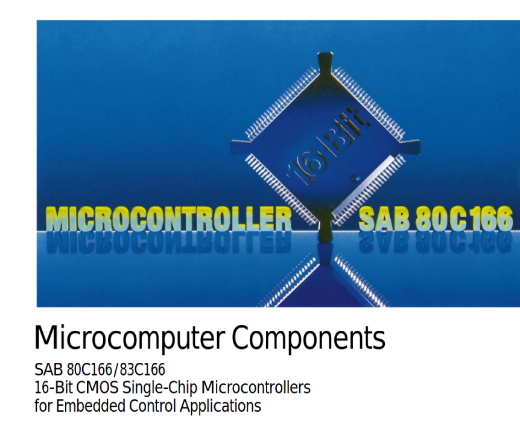

## Micro-Controller-Introduction

---

### by Jogi 

---

* Short History / Introduction
* Different Micro-Controllers
* Programming-Environments
* Microcontroller-Learning-Environments
* Back to History
* Demo ("Hello World")

---

### This was my first computer (6502 CPU)

---

### This _IS_ still my first computer

---

### A klone of KIM 1 (by Commodore, 6502 CPU) 

---

### Famous Apple ][ (6502 CPU)

---

### Famous Commodore C64 (6502 CPU)

---

### Architecture of Junior

---

- egon
- hugo
- some more stuff

---

## And one final slide

| one   | two   |
|-------|-------|
| 1     | 2     |
| eins  | zwei  |

- egon
- hugo

---

### 2006 Arduino enters the world

---

### 2012 Raspberry PI Enters the world

__STOP__ : Raspberry Pi is __NOT__ a Micro-Controller

---

### 2014 ESP 8266 enters the world

---

### 2016 ESP 32 enters the world

---

### 2021 Raspberry Pi Pico enters the world

---

### Linkcollection for now

* KIM-Uno: https://www.hackster.io/obsolescence/kim-uno-a-6502-kim-1-computer-on-arduino-e5c82c
* 6502 : http://www.6502.org/source/
* UF2 : https://makecode.com/blog/one-chip-to-flash-them-all 
* UF2 : https://github.com/microsoft/uf2
* Pico - Arduino : https://www.heise.de/tests/Raspberry-Pico-mit-der-Arduino-IDE-programmieren-6001575.html
* https://www.mikrocontroller.net/
* Simulator Servo : https://wokwi.com/arduino/libraries/Servo/Knob
* PICO-Sdk Pimoroni : https://github.com/pimoroni/pimoroni-pico/blob/main/setting-up-the-pico-sdk.md
* The Junior-Computer : https://archive.org/details/ElektorMagazine/Elektor%5Bnonlinear.ir%5D%201980-05/page/n9/mode/2up?view=theater

---

### Legal stuff

* Von Rama &amp; Musée Bolo - Eigenes Werk, CC BY-SA 2.0 fr, https://commons.wikimedia.org/w/index.php?curid=11292404
* Von Narnars0 - Eigenes Werk, CC BY-SA 3.0, https://commons.wikimedia.org/w/index.php?curid=32247697
* Von Evan-Amos - Eigenes Werk, Gemeinfrei, https://commons.wikimedia.org/w/index.php?curid=17414886

---

## Raspberry Pi Pico

* always starts as UF2-Board
* Microsoft-defined USB-Format
* especially dedicated for downloading firmware to µC via USB

---

### C/C++ via SDK

* THE Guide from Raspberry : https://datasheets.raspberrypi.org/pico/getting-started-with-pico.pdf
* THE SDK on Github : https://github.com/raspberrypi/pico-sdk

---

### Arduino Environment

* https://www.heise.de/tests/Raspberry-Pico-mit-der-Arduino-IDE-programmieren-6001575.html

---

### Python 

* Micro-Python
* Circuit Python

---

### Micro-Python

* Attempt to put Python on Micro-Controller-Boards
* Started with an own Board
* Interpreter now available for a lot of µC-Boards
* Including the Raspberry-Pi Pico
* Blink-Programm : https://projects.raspberrypi.org/en/projects/getting-started-with-the-pico/5

---

### Circuit-Python

* Basics by Adafruit : https://learn.adafruit.com/getting-started-with-raspberry-pi-pico-circuitpython/circuitpython-programming-basics

---

### Servo at Raspberry Pi Pico

* https://www.youngwonks.com/blog/How-to-use-a-servo-motor-with-the-Raspberry-Pi-Pico
* Attention : Micro-Python

---

### The PIO

* Programmable IO
* "a Co-Processor", dedicated to programm even new "buses"
* offloads work from the CPU, compared to "bit-banging"
* https://www.cnx-software.com/2021/01/27/a-closer-look-at-raspberry-pi-rp2040-programmable-ios-pio/

---

### Nice getting started

* https://ordina-jworks.github.io/iot/2021/03/25/Getting-started-with-the-pi-pico.html
* Shows also SDK, Micro-Python and Circuit-Python
* 

---

## Raspberry PI (not pico )

* Is NOT a microController
* Is too "complicated"
* Its CPU is intenden to run General Purpose OS for Multi-User/Multi-Task, eg Linux
* Has all the fancy stuff a CPU needs to run General Purpose OS ( Memory Management Unit, Caches, ... ) and is therefore much to difficult to setup fpr just "simple" Controller-Tasks
* Has a lot in common with Micro-Controllers, especially PINS to be used as GPIO, I2C, SPI-Bus, ...
* Blinking LED in python (german) : https://draeger-it.blog/raspberry-pi-tutorial-1-blinkende-leds/
* Blinking LED in python (english) : https://www.nzbuilds.com/post/getting-started-with-raspberry-pi-led-blinking-on-raspberry-pi-zero
* Baremetal on a Raspberry-Pi Zero : https://github.com/dwelch67/raspberrypi-zero

---

### Other PICO-Links

* https://www.heise.de/news/Konkurrenz-fuer-Raspberry-Pico-mit-USB-C-und-Winzfaktor-6040934.html
* https://www.heise.de/developer/artikel/Des-Prozessors-Kern-Parallelisierung-auf-dem-Raspberry-Pi-Pico-mit-C-und-C-6000386.html

##  

---

---

---

---

---

---

---

---

---

---

---

---

---

---

---

---

---

---

---

---

---

---

---

---

